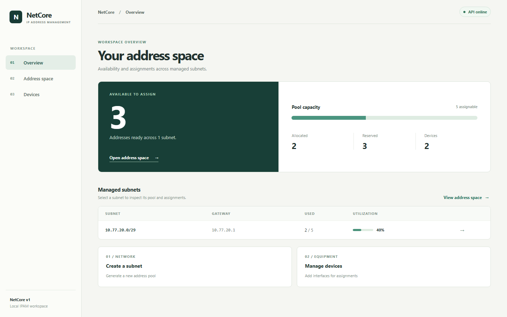

# NetCore

NetCore manages IPv4 subnets and the addresses assigned to device interfaces. I built it to work through a specific systems problem: how to keep an address inventory correct when requests arrive at the same time.

The result is a working IP address management application with a React dashboard, a Spring Boot API, and Oracle persistence. An address is either reserved, available, or assigned to one interface; competing requests cannot claim it twice.



*The overview running locally with Oracle Free and sample inventory data.*

## What you can do

1. Create an IPv4 subnet from `/24` to `/30`. NetCore generates its address pool and reserves the network, broadcast, and optional gateway addresses.
2. Register devices and their network interfaces.
3. Assign the next available address or request a specific one. See the assignment on both the address and interface views.
4. Release an address when it is no longer in use. Filter and page through a subnet's pool to inspect its state.

For example, creating `10.20.30.0/29` with gateway `10.20.30.1` makes `.0`, `.1`, and `.7` reserved. The other five addresses can be assigned to interfaces.

## How NetCore keeps the inventory consistent

- **One transaction creates a pool.** A subnet and every address in its pool are saved together. A failure rolls back the whole creation.
- **One subnet lock governs allocation.** Assigning or releasing an address takes a database write lock on its subnet. Requests for the same subnet make their decisions in sequence; different subnets can proceed independently.
- **The database rejects overlap.** NetCore does not model separate routing domains, so an address cannot appear in two subnet pools. A unique constraint enforces this even if two requests try to create overlapping pools concurrently.

These choices favor a clear correctness argument over maximum throughput. The [architecture notes](docs/architecture.md) cover the model, transaction boundaries, and trade-offs in more detail.

## Run the application

With Docker running, start the full stack from the repository root:

```bash
docker compose up --build
```

Open [localhost:3000](http://localhost:3000). Compose starts Oracle Free, the API, and the dashboard. Oracle's first start may take several minutes. Data lives in a named volume and survives `docker compose down`.

The Compose password is a local development default. Set `NETCORE_DB_PASSWORD` in an untracked `.env` file before using the stack on a shared machine.

### Work on the code without Oracle

Use Java 25 and Node.js 22. The backend defaults to in-memory H2, and the repository includes the Maven Wrapper. In one terminal:

```bash
cd backend
./mvnw spring-boot:run
```

On Windows, run `.\mvnw.cmd spring-boot:run`. In another terminal:

```bash
cd frontend
npm ci
npm run dev
```

Open [localhost:5173](http://localhost:5173). The development server forwards API requests to the backend on port 8080. H2 data is cleared when the backend stops.

## Verify the behavior

From `backend`, run `./mvnw clean verify` (or `.\mvnw.cmd clean verify` on Windows). Tests cover IPv4 calculations, pool generation, invalid state changes, persistence, HTTP workflows, and concurrent allocation.

With Docker running, `./mvnw -P oracle-integration verify` starts Oracle Free through Testcontainers, applies both Flyway migrations, validates the schema, and exercises allocation under contention. From `frontend`, run `npm ci`, `npm run format:check`, and `npm run build`. GitHub Actions runs these checks on pushes and pull requests.

## API at a glance

The dashboard uses the same REST API exposed under `/api/v1`:

| Action | Endpoint |
| --- | --- |
| Create or list subnets | `POST /subnets` · `GET /subnets` |
| Inspect a subnet's addresses | `GET /subnets/{id}/addresses` |
| Allocate the next address | `POST /subnets/{id}/allocate-next` |
| Allocate or release a specific address | `POST /subnets/{id}/addresses/{address}/allocate` · `POST /subnets/{id}/addresses/{address}/release` |
| Create or list devices | `POST /devices` · `GET /devices` |
| Add or list interfaces | `POST /devices/{id}/interfaces` · `GET /devices/{id}/interfaces` |

Subnet creation accepts `{"networkAddress":"10.20.30.0","prefixLength":29,"gatewayAddress":"10.20.30.1"}`. Allocation accepts `{"networkInterfaceId":1}`. Invalid requests and conflicting operations return structured errors.

## Scope

NetCore materializes one database row per address, which is why pools are limited to `/24`–`/30`. Locking one subnet at a time is simple and safe for this scale but limits throughput within a heavily used subnet. The dashboard is a local operations tool; it has no authentication, IPv6 support, or device/DHCP provisioning.
